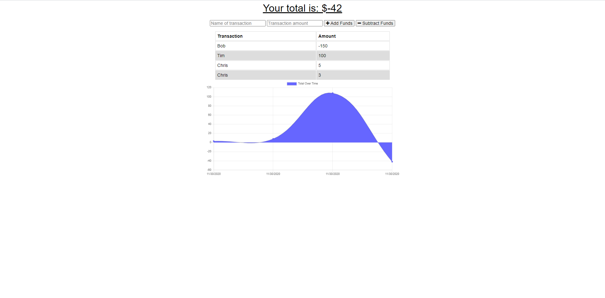

# Offline_Budget_Trackers


[](https://github.com/chrisjmckeown/Offline_Budget_Trackers/blob/master/LICENSE)[](https://GitHub.com/chrisjmckeown/Offline_Budget_Trackers/graphs/contributors/)[](https://GitHub.com/chrisjmckeown/Offline_Budget_Trackers/pull/)

## Description

For avid travellers who want the ability to track their withdrawals and deposits with or without a data/internet connection, so their account balance is accurate when traveling.

## Table of Contents

- [Installation](#Installation)
- [Usage](#Usage)
- [License](#License)
- [Contributing](#Contributing)
- [Tests](#Tests)
- [Questions](#Questions)

## Installation

1. Download and install [Node.js](http://nodejs.org/) (that will install npm as well)
2. Install the dependancies.<br />
   ```
   npm install
   ```
3. You are done for the setup, run the app using
   ```
   npm run watch
   ```

### Technologies Utilized


   

## Usage

Once installed:

- To run the Budget Tracker locally, use:

```
   node run watch
```

<h3>The Budget Tracker app allows:</h3>
<ul>
    <li>
        <p>A user to be able to add expenses and deposits, tracking them in a table and graph, both when online and offline.</p>
    </li>
    <li>
        <p>Offline Functionality:</p>
        <ul>
            <li>
                Enter deposits offline
            </li>
            <li>
                Enter expenses offline
            </li>
        </ul>
  </li>
  <li>
      <p>When brought back online:</p>
        <ul>
            <li>
                Offline entries are be added to tracker.
            </li>
        </ul>
  </li>
</ul>

Home page:


### Heroku Deployment

View the deployed app here: [deployed app]()

## License

[](https://github.com/chrisjmckeown/Offline_Budget_Trackers/blob/master/LICENSE)

## Contributing

Pull requests are welcome. For major changes, please open an issue first to discuss what you would like to change.

[](code_of_conduct.md)

## Tests

Run the application, turn network from online to offline, making deposites and withdrawal and reconnecting to the network, ensure the data is persistant.  

## Questions

- Follow me at: <a href="https://github.com/chrisjmckeown" target="_blank">https://github.com/chrisjmckeown</a>
- Please email with any question at: chris.j.mckeown@hotmail.com

© 2020 chrisjmckeown
